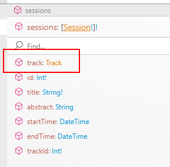
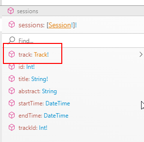
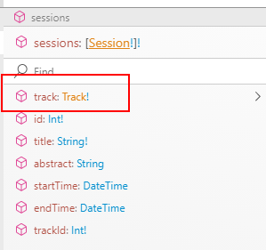


## Description

 - The `Track` field in the `Session` model is non-nullable.

 - When the `SessionType` uses a resolver the `Track` field is nullable.

   

 - When the `SessionType` doesn't use a resolver the `Track` field is non-nullable as defined on the model.

   

 - When the `SessionType` uses a resolver and we force the nullability with a `.Type` decoration the `Track` field is non-nullable.

   

